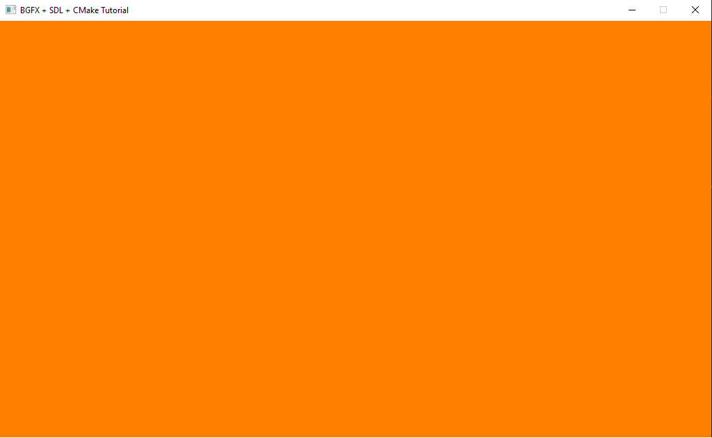

# minimal-bgfx-sdl-example

Minimal example of setting up SDL + BGFX. Compiled this on windows only but setup in code to support all platforms.

## Building
1. run git submodule update --init --recursive
2. create an out / build folder and cd to it
3. run cmake ..
4. profit

